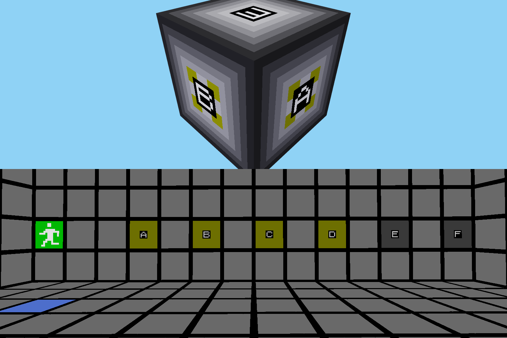

# area\_containers

This is a mod for [Minetest][1]. It implements an "area container," that is,
a node that holds an area in which you can walk around and build stuff. The
structures in the container can communicate with the outside using
[Mesecons][2] and/or [Digilines][3]. Items can pass in and out through tubes
from the [Pipeworks][4] mod.

## Locking

Area containers can be locked. To do so, first craft a lock. Then punch a
container with the lock (you must be either the one who built the container or
one able to bypass protection.)

If a container is unowned and you can bypass protection, you can claim it by
locking it.

To let other people in, first craft a blank key. Then punch your container with
the key, binding the key to the container. Other people can enter the container
while holding the key. The container contents themselves are not protected in
any way.

You can unlock your container by punching it with your bare hand. You must
remove the lock before breaking the container. If you reinstall the lock,
no prior keys will work.

## Caveats

- While a container is not diggable until you empty it of nodes and objects,
  other mods may let you pick it up in order to move it. Doing so will probably
  lead to loss of the contents. (But you _can_ push containers with pistons.)
- You cannot yet pass a mesecons signal from one port to another with no delay
  inbetween due to [this bug in Mesecons][5]. Other related issues may exist.
- Only up to 65535 containers may exist at any one time.

## Licenses

### Source code

The source code of this project is licensed under the LGPL v3 (or later,)
as stated in the source code files themselves.

### Images and other files not otherwise licensed

These files are licensed under a [CC BY-SA 3.0 license][6].

They are also under the same copyright as the source files:

Copyright © 2021 Jude Melton-Houghton

[1]: https://www.minetest.net/
[2]: https://mesecons.net/
[3]: https://mesecons.net/digilines.html
[4]: https://gitlab.com/VanessaE/pipeworks/-/wikis/home
[5]: https://github.com/minetest-mods/mesecons/issues/571
[6]: https://creativecommons.org/licenses/by-sa/3.0/
